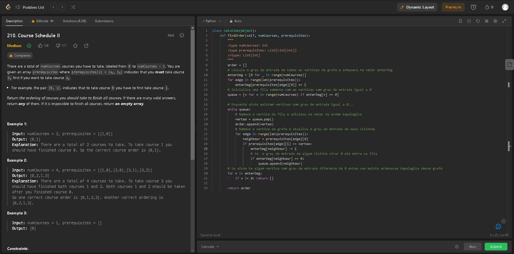
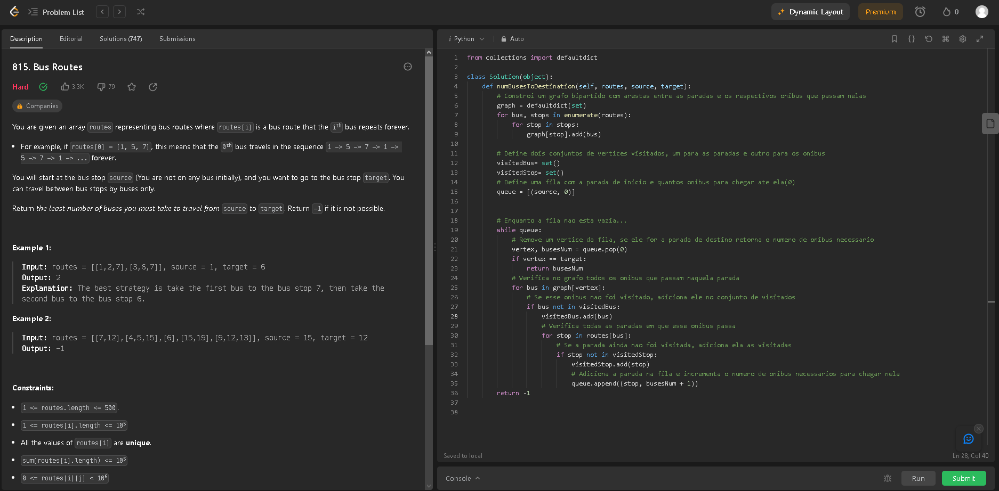
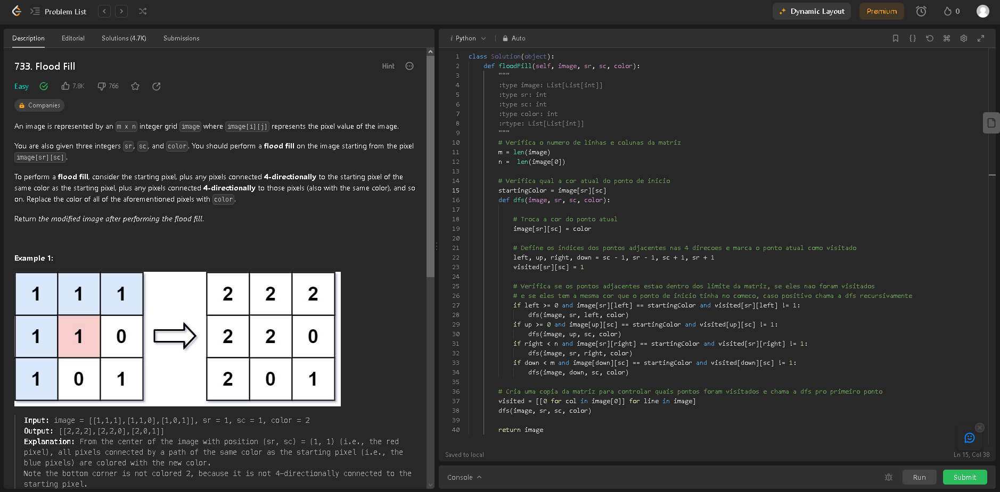
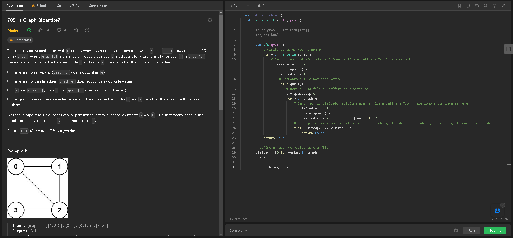
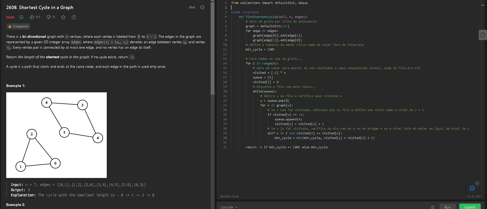

# Grafos1_Exercicios_Juiz

**Conteúdo da Disciplina**: Grafos1<br>

## Alunos
|Matrícula | Aluno |
| -- | -- |
| 21/1029620  | Douglas Alves dos Santos |

## Sobre 
Este repositório apresenta a solução de exercícios de juíz online do site [LeetCode](https://leetcode.com) relacionados ao assunto de grafos. Foram resolvidos um total de 5 exercícios, sendo 1 fácil, 2 médios e 2 difíceis.

## Screenshots

### [Course Schedule II](https://leetcode.com/problems/course-schedule-ii/description/) (Médio)



Esse exercício envolve o uso da ordenação topológica de um grafo para encontrar a ordem entre cursos com pré-requisitos.
[Código](./exercicios/course-schedule-ii.py)

### [Bus Routes](https://leetcode.com/problems/bus-routes/description/) (Difícil)



Esse exercício envolve o uso de BFS para encontrar a menor quantidade de ônibus necessários para ir de uma parada de origem à uma parada de destino.
[Código](./exercicios/bus-routes.py)


### [Flood Fill](https://leetcode.com/problems/flood-fill/description/) (Fácil)



Esse exercício envolve visualizar uma matriz de pixels como um grafo de forma a utilizar buscas para colorir essa imagem utilizando flood fill.
[Código](./exercicios/flood-fill.py)


### [Is Graph Bipartite?](https://leetcode.com/problems/is-graph-bipartite/description/) (Médio)



Esse exercício envolve fazer uma BFS colorindo os nós de um grafo de modo a verificar se ele pode ser bipartido, ou não.
[Código](./exercicios/is-graph-bipartite.py)


### [Shortest Cycle in a Graph](https://leetcode.com/problems/shortest-cycle-in-a-graph/description/) (Difícil)



Esse exercício envolve o uso de BFS para identificar o menor ciclo existente em um grafo, caso ele apresente quaisquer ciclos.
[Código](./exercicios/cycle.py)


## Instalação 
**Linguagem**: Python <br>

Caso queira testar o código dos exercícios nos juízes online, não é preciso instalar nada, mas caso queira rodar os exercícios localmente, é preciso ter o python instalado ([guia de instalação do python](https://wiki.python.org/moin/BeginnersGuide/Download)).

## Uso 
O código de cada questão pode ser copiado e submetido ao juíz online no seu respectivo link. Também é possível realizar o teste localmente ao abrir a pasta exercicios e executar o seguinte comando:

```
python3 nomeDoArquivo.py

``` 

## Apresentação

Foi gravado um vídeo explicando a solução de cada um dos exercícios, segue o [link](https://www.youtube.com/watch?v=vF46aKxojqY)


